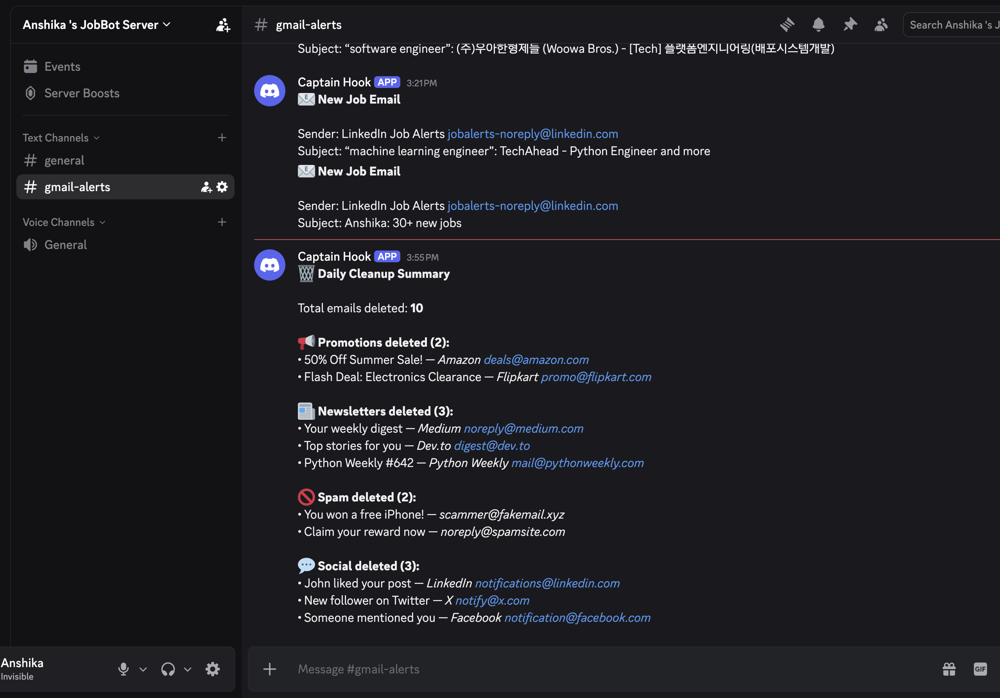

<p align="center">
  
  
  
</p>

<h1 align="center">📬 Gmail Automation Agent</h1>

<p align="center">
  <em>An AI-powered Gmail agent that classifies, cleans, and notifies — automatically.</em>
</p>

<p align="center">
  
  
  
  
  
</p>

---

## 🤖 What Does It Do?

This agent connects to your Gmail inbox and **automatically**:

| Action                   | Description                                                         |
| ------------------------ | ------------------------------------------------------------------- |
| 🧠 **AI Classification** | Uses `facebook/bart-large-mnli` (zero-shot) to classify every email |
| 🗑️ **Auto-Delete**       | Trashes newsletters, spam, promotions & social emails               |
| 💼 **Job Alerts**        | Sends Discord notifications for job-related emails                  |
| 📊 **Daily Summary**     | Posts a cleanup report to Discord at the end of each run            |
| 🔁 **Smart Tracking**    | Remembers processed emails so nothing gets handled twice            |

---

## 📸 How It Works

```
┌─────────────┐     ┌──────────────┐     ┌─────────────────┐
│  Gmail API   │────▶│  AI Classifier│────▶│  Take Action     │
│  (OAuth 2.0) │     │  (BART-MNLI)  │     │                  │
└─────────────┘     └──────────────┘     │  📰 Newsletter → 🗑️│
                                          │  🚫 Spam     → 🗑️│
                                          │  💬 Social   → 🗑️│
                                          │  💼 Job      → 📢│
                                          │  ⭐ Important → ✅│
                                          └─────────────────┘
                                                   │
                                                   ▼
                                          ┌─────────────────┐
                                          │  Discord Summary │
                                          │  🗑️ Daily Report │
                                          └─────────────────┘
```

---

## 📂 Project Structure

```
gmail-agent/
├── agent.py            # Entry point — orchestrates the pipeline
├── config.py           # Loads secrets from .env, defines constants
├── auth.py             # Gmail OAuth 2.0 authentication
├── classifier.py       # AI zero-shot email classification
├── email_actions.py    # Inbox scanning, deletion, daily summary
├── discord_notify.py   # Discord webhook notifications
├── tracking.py         # Processed email persistence (JSON)
├── .env                # 🔒 Secrets (not committed)
├── .gitignore          # Keeps secrets & cache out of git
├── credentials.json    # 🔒 Google OAuth client config (not committed)
└── requirements.txt    # Python dependencies
```

---

## ⚡ Quick Start

### 1. Clone the repo

```bash
git clone https://github.com/your-username/gmail-agent.git
cd gmail-agent
```

### 2. Create a virtual environment

```bash
python3 -m venv venv
source venv/bin/activate
```

### 3. Install dependencies

```bash
pip install -r requirements.txt
```

### 4. Set up Google Cloud credentials

1. Go to [Google Cloud Console](https://console.cloud.google.com/)
2. Create a new project (or select an existing one)
3. Enable the **Gmail API**
4. Go to **Credentials** → **Create Credentials** → **OAuth Client ID**
5. Choose **Desktop App** as the application type
6. Download the JSON file and save it as `credentials.json` in the project root

### 5. Set up Discord Webhook

1. Open your Discord server → **Server Settings** → **Integrations** → **Webhooks**
2. Click **New Webhook**, name it, choose a channel
3. Copy the **Webhook URL**

### 6. Configure environment variables

Create a `.env` file in the project root:

```env
GMAIL_SCOPES=https://www.googleapis.com/auth/gmail.modify
DISCORD_WEBHOOK=https://discord.com/api/webhooks/your-webhook-url-here
```

### 7. Run the agent

```bash
python agent.py
```

> **First run:** A browser window will open for Google OAuth consent. After authorizing, a `token.json` is saved so you won't need to log in again.

---

## 🧠 AI Classification Details

The agent uses **facebook/bart-large-mnli** — a ~400M parameter model fine-tuned for Natural Language Inference, repurposed here for **zero-shot classification**.

### Classification Labels

| Label             | Action                           |
| ----------------- | -------------------------------- |
| `important email` | ✅ Kept in inbox                 |
| `newsletter`      | 🗑️ Moved to trash                |
| `spam`            | 🗑️ Moved to trash                |
| `job opportunity` | 📢 Discord alert + kept in inbox |

### Optimization

Before running AI inference, the agent checks Gmail's built-in labels:

- `CATEGORY_PROMOTIONS` → Treated as `newsletter` (skips AI)
- `CATEGORY_SOCIAL` → Treated as `social` and trashed (skips AI)

This reduces unnecessary model calls and speeds up processing.

---

## 📢 Discord Notifications

### Job Alert

```
📧 New Job Email

Sender: recruiter@company.com
Subject: Software Engineer Opening — Apply Now
```

### Daily Cleanup Summary

```
🗑️ Daily Cleanup Summary

Total emails deleted: 42

📢 Promotions deleted (15):
• 50% off everything — Store XYZ
• Weekly deals — Shopping App
  ...and 13 more

📰 Newsletters deleted (10):
• Tech Weekly #203 — newsletter@tech.com

🚫 Spam deleted (7):
• You've won a prize! — spam@fake.com

💬 Social deleted (10):
• John commented on your post — notifications@social.com
```

<p align="center">
  
  <br/>
  <em>📊 Daily Cleanup Summary — Discord notification</em>
</p>

---

## ⚙️ Configuration Reference

| Variable                | Location        | Description                      |
| ----------------------- | --------------- | -------------------------------- |
| `GMAIL_SCOPES`          | `.env`          | Gmail API permission scope       |
| `DISCORD_WEBHOOK`       | `.env`          | Discord channel webhook URL      |
| `PROCESSED_FILE`        | `config.py`     | Path to processed email IDs file |
| `CLASSIFICATION_LABELS` | `classifier.py` | AI classification categories     |

---

## 📦 Dependencies

| Package                    | Purpose                             |
| -------------------------- | ----------------------------------- |
| `google-auth-oauthlib`     | Gmail OAuth 2.0 flow                |
| `google-api-python-client` | Gmail API client                    |
| `transformers`             | Hugging Face AI pipelines           |
| `torch`                    | PyTorch backend for model inference |
| `requests`                 | Discord webhook HTTP calls          |
| `python-dotenv`            | Load secrets from `.env`            |

---

## 🛡️ Security Notes

- `credentials.json`, `token.json`, and `.env` are in `.gitignore` — **never committed**
- Webhook URLs and API scopes are loaded from environment variables
- The AI model runs **locally** — no data sent to external AI services
- Gmail scope is limited to `gmail.modify` (read + trash, no permanent delete)

---

## 🗺️ Roadmap

- [ ] Scheduled runs via `cron` or `systemd` timer
- [ ] Custom classification labels via `.env`
- [ ] Whitelist/blacklist specific senders
- [ ] Email forwarding for important emails
- [ ] Web dashboard for monitoring

---

## 🤝 Contributing

1. Fork the repo
2. Create a feature branch (`git checkout -b feature/my-feature`)
3. Commit your changes (`git commit -m 'Add my feature'`)
4. Push to the branch (`git push origin feature/my-feature`)
5. Open a Pull Request

---

<p align="center">
  Made with ❤️ by <a href="https://github.com/your-username">Anshika Chauhan</a>
</p>
